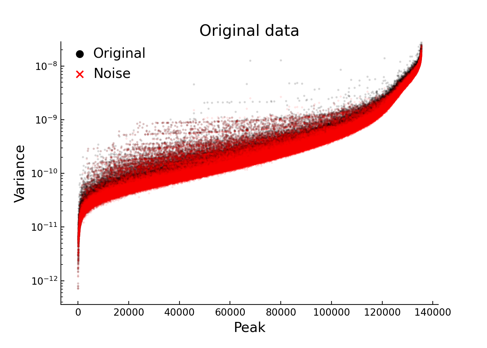
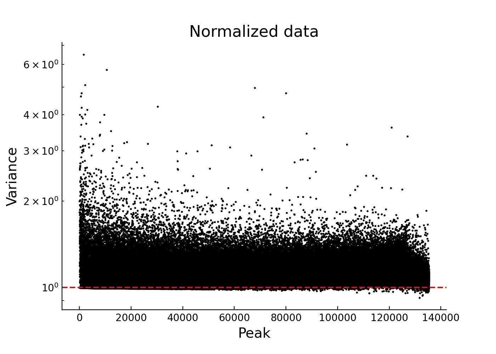
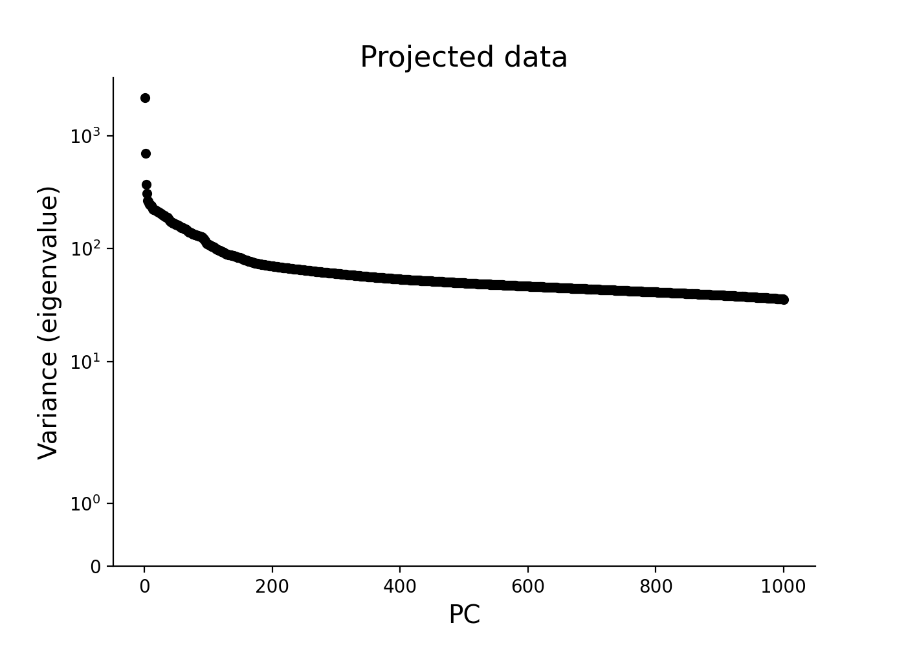
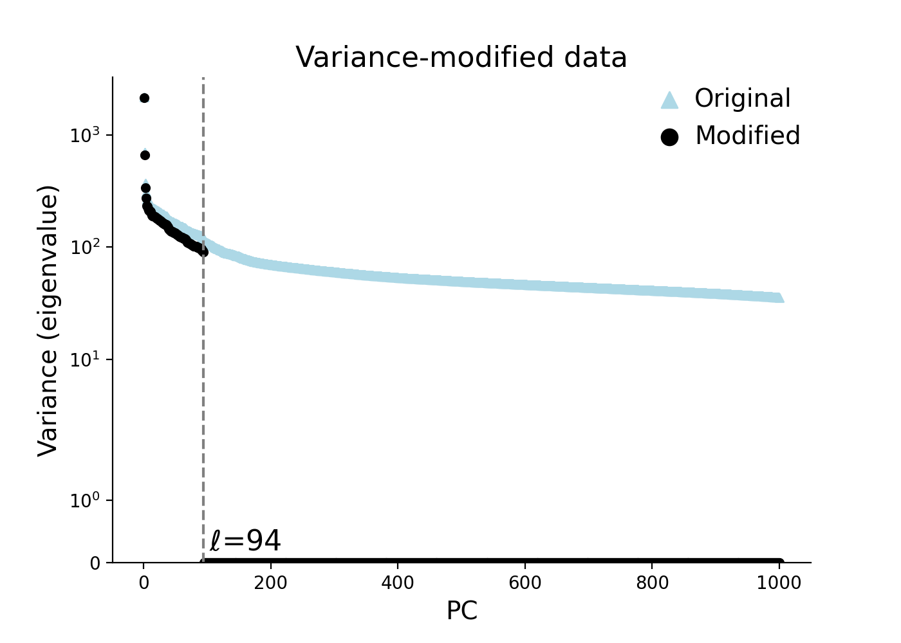
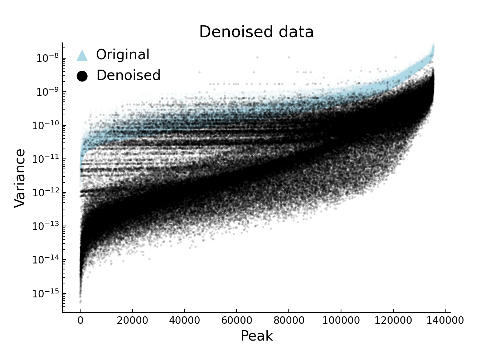
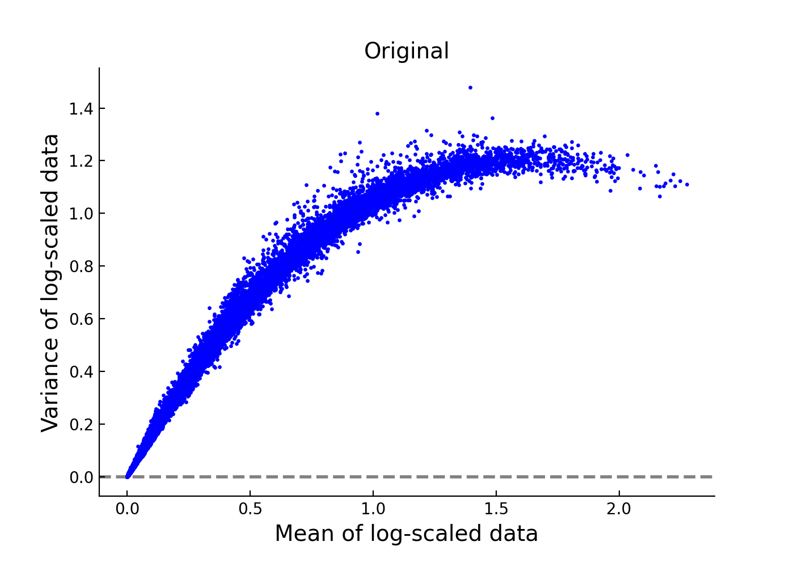
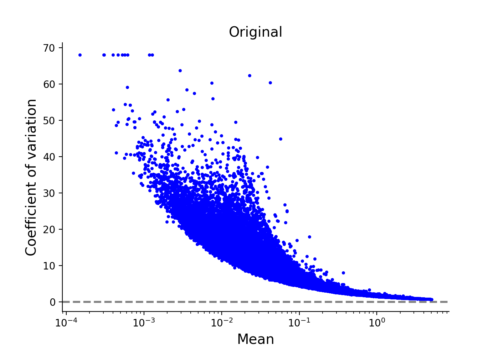
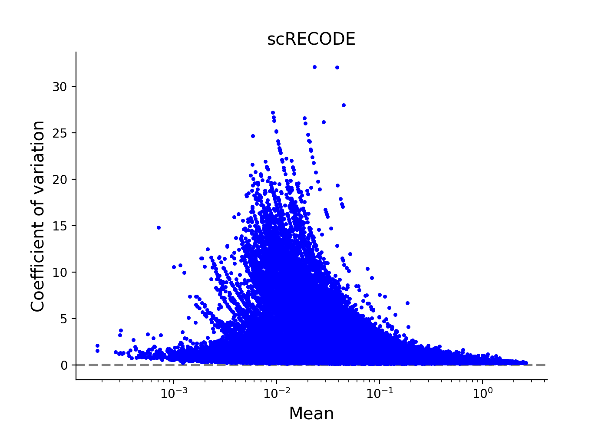

scATAC-seq data - 10X chromium HDF5 file
========

We show an exmaple for scATAC-seq data produced by 10X Chromium. 
We use sample `5k Peripheral blood mononuclear cells (PBMCs) from a healthy donor (Next GEM v1.1)` (4,623 cells and 135,377 peaks) in `10X Genomics Datasets <https://www.10xgenomics.com/jp/resources/datasets>`_.  
The test data is directly avairable from `Feature / cell matrix HDF5 (filtered)` in `here <https://www.10xgenomics.com/jp/resources/datasets/5-k-peripheral-blood-mononuclear-cells-pbm-cs-from-a-healthy-donor-next-gem-v-1-1-1-1-standard-2-0-0>`_ (registration required).

We use `scanpy <https://scanpy.readthedocs.io/en/stable/>`_ to read/write 10X HDF5 file (\*\*\*.h5). 
Import  ``numpy``, ``scipy``, and ``scanpy`` in addlition to ``screcode``. 

.. code-block:: python

	import screcode
	import numpy as np
	import scipy
	import scanpy

Imput data from HDF5 file (\*\*\*.h5). 

.. code-block:: python

	h5_file = 'atac_pbmc_5k_nextgem_filtered_peak_bc_matrix.h5'
	adata = scanpy.readwrite._read_v3_10x_h5(h5_file)

Apply scRECODE with option ``seq_target='ATAC'``. The denoised data is created in ``data_scRECODE``.

.. code-block:: python

	recode = screcode.scRECODE(seq_target='ATAC')
	data_scRECODE = recode.fit_transform(data)

.. parsed-literal::

	start scRECODE for scATAC-seq
	end scRECODE for scATAC-seq
	log: {'seq_target': 'ATAC', '#significant peaks': 128923, '#non-significant peaks': 6450, '#silent peaks': 4, 'ell': 94, 'Elapsed_time': '209.465[sec]'}
	
Write the denoised data as HDF5 file. 

.. code-block:: python

	adata_scRECODE = adata.copy()
	adata_scRECODE.X = scipy.sparse.csc_matrix(data_scRECODE)
	adata_scRECODE.var['noise_variance'] = recode.noise_variance_
	adata_scRECODE.var['normalized_variance'] = recode.normalized_variance_
	adata_scRECODE.var['significance'] = recode.significance_
	adata_scRECODE.var_names_make_unique()
	output_filename = 'atac_pbmc_5k_nextgem_filtered_peak_bc_matrix_scRECODE.h5'
	adata_scRECODE.write(output_filename)

Check applicability. 

.. code-block:: python

	recode.check_applicability()

.. parsed-literal::

	applicabity: (A) Strong applicable

.. image:: ../image/Example_10X_ATAC_applicability.png

Show preprocessing of scATAC-seq data and 5 procedures of scRECODE. 

.. code-block:: python

	recode.plot_procedures()

Show scatter plots of mean vs variance before and after scRECODE. 	

.. code-block:: python

	recode.plot_mean_variance()

.. image:: ../image/Example_10X_ATAC_mean_var_scRECODE.png

Show scatter plots of mean vs CV (coefficient of variation) before and after scRECODE. 	

.. code-block:: python

	recode.plot_mean_cv()

Check the log. 

.. code-block:: python

	recode.log_
	

.. parsed-literal::

	{'seq_target': 'ATAC',
	 '#significant peaks': 128923,
	 '#non-significant peaks': 6450,
	 '#silent peaks': 0,
	 'ell': 94,
	 'Elapsed_time': '209.465[sec]',
	 'Applicability': '(A) Strong applicable',
	 'Rate of 0 < normalized variance < 0.9': '0%',
	 'Peak density of normalized variance': 1.0792379955790716}

Show the peak rank based on the CV (detection rate>1%). 

.. code-block:: python
	 
	import pandas as pd
	n_show_peaks = 10
	detection_rate_ = np.sum(np.where(adata.X.toarray()>0,1,0),axis=0)/adata.shape[0]
	idx_dr = detection_rate_>0.01
	idx_rank = np.argsort(recode.cv_[idx_dr])[::-1]
	peakrank = pd.DataFrame({'peak':adata.var.index[idx_dr][idx_rank],
                       'cv':recode.cv_[idx_dr][idx_rank],
                       'normalized_variance':recode.normalized_variance_[idx_dr][idx_rank],
                       'detection_rate':detection_rate_[idx_dr][idx_rank],
                       'significance':recode.significance_[idx_dr][idx_rank]},
                      index=np.arange(len(adata.var.index[idx_dr]))+1)
	peakrank.head(n_show_peaks)
	 
.. raw:: html

	

  
	<table border="1" class="dataframe">
		<thead>
		  <tr style="text-align: right;">
		    <th></th>
		    <th>peak</th>
		    <th>cv</th>
		    <th>normalized_variance</th>
		    <th>detection_rate</th>
		    <th>significance</th>
		  </tr>
		</thead>
		<tbody>
		  <tr>
		    <th>1</th>
		    <td>chr12:56537100-56538049</td>
		    <td>22.385567</td>
		    <td>1.950203</td>
		    <td>0.012330</td>
		    <td>significant</td>
		  </tr>
		  <tr>
		    <th>2</th>
		    <td>chr5:172085397-172086190</td>
		    <td>21.785703</td>
		    <td>1.925941</td>
		    <td>0.013628</td>
		    <td>significant</td>
		  </tr>
		  <tr>
		    <th>3</th>
		    <td>chr5:142849473-142850355</td>
		    <td>20.746717</td>
		    <td>1.912967</td>
		    <td>0.013195</td>
		    <td>significant</td>
		  </tr>
		  <tr>
		    <th>4</th>
		    <td>chr15:65211823-65212691</td>
		    <td>19.731178</td>
		    <td>1.941612</td>
		    <td>0.013628</td>
		    <td>significant</td>
		  </tr>
		  <tr>
		    <th>5</th>
		    <td>chr12:55983356-55984183</td>
		    <td>19.309734</td>
		    <td>2.739442</td>
		    <td>0.021847</td>
		    <td>significant</td>
		  </tr>
		  <tr>
		    <th>6</th>
		    <td>chr8:145026449-145027358</td>
		    <td>18.900971</td>
		    <td>1.880035</td>
		    <td>0.016223</td>
		    <td>significant</td>
		  </tr>
		  <tr>
		    <th>7</th>
		    <td>chr6:146878018-146878580</td>
		    <td>18.015273</td>
		    <td>1.003125</td>
		    <td>0.010599</td>
		    <td>significant</td>
		  </tr>
		  <tr>
		    <th>8</th>
		    <td>chrX:23844287-23845208</td>
		    <td>17.899955</td>
		    <td>2.794661</td>
		    <td>0.024876</td>
		    <td>significant</td>
		  </tr>
		  <tr>
		    <th>9</th>
		    <td>chr3:184305351-184306241</td>
		    <td>17.598467</td>
		    <td>1.009926</td>
		    <td>0.010383</td>
		    <td>significant</td>
		  </tr>
		  <tr>
		    <th>10</th>
		    <td>chr12:56288643-56289492</td>
		    <td>17.502620</td>
		    <td>1.026666</td>
		    <td>0.010167</td>
		    <td>significant</td>
		  </tr>
		</tbody>
	</table>
	

