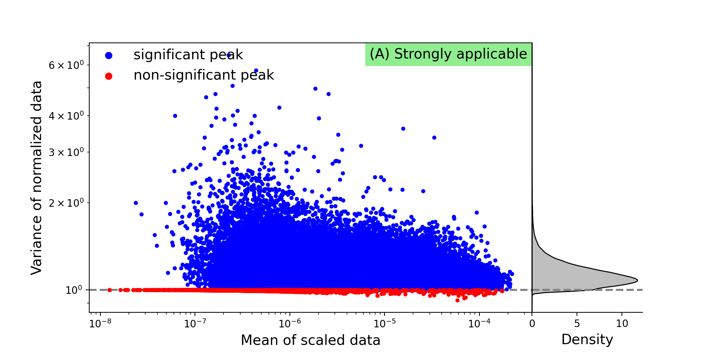
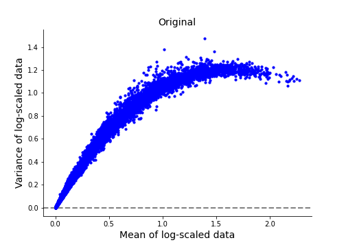
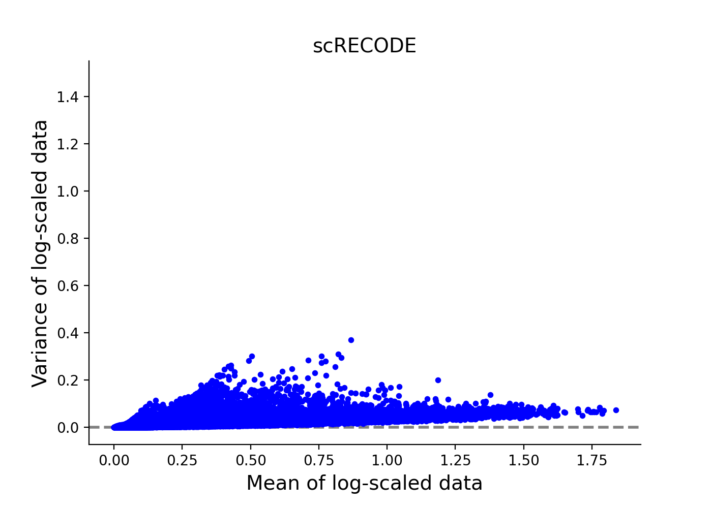
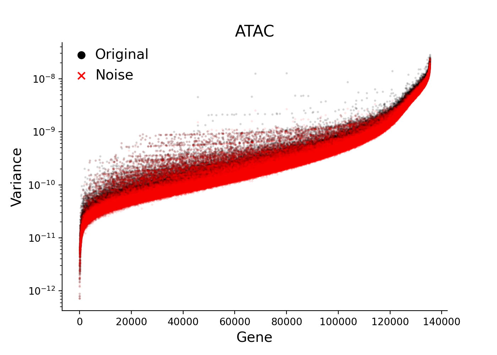
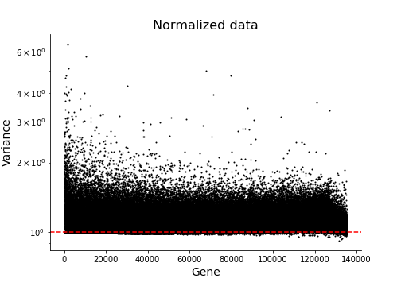
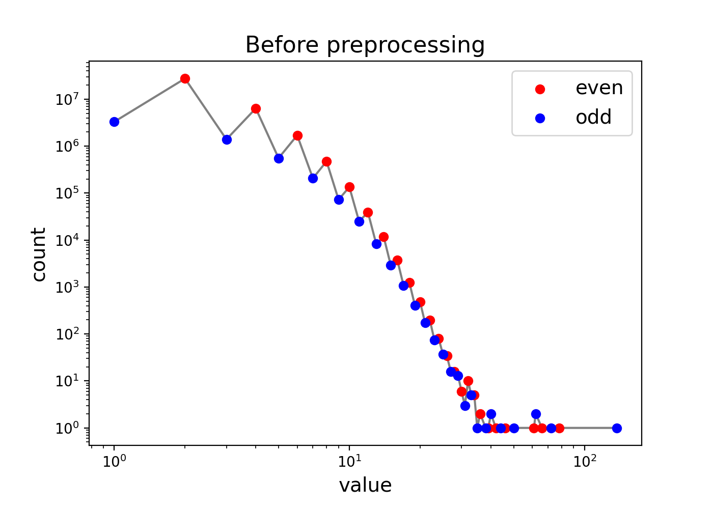
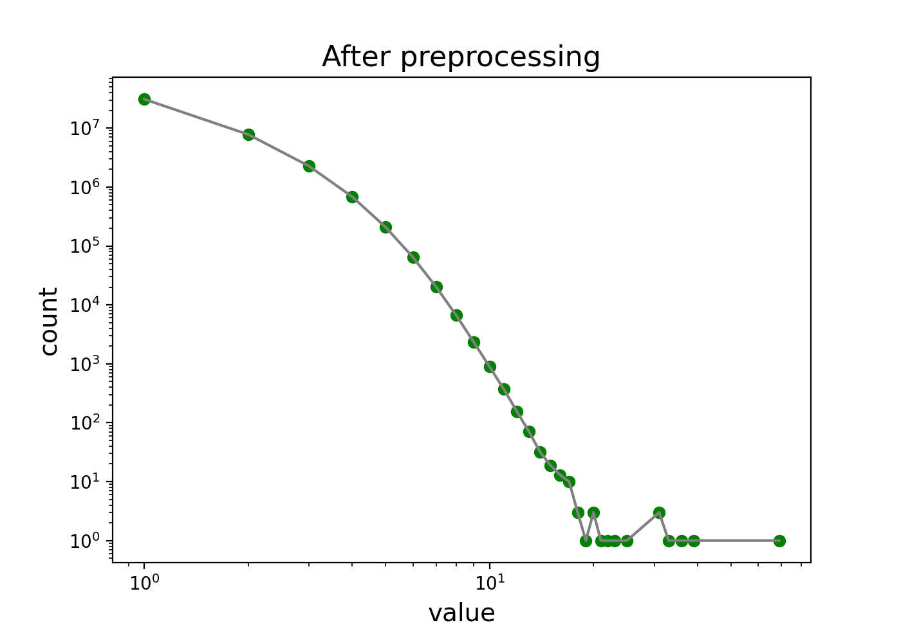

scATAC-seq data - 10X chromium HDF5 file
========

We show an exmaple for scATAC-seq data produced by 10X Chromium. 
We use sample `5k Peripheral blood mononuclear cells (PBMCs) from a healthy donor (Next GEM v1.1)` (4,623 cells and 135,377 peaks) in `10X Genomics Datasets <https://www.10xgenomics.com/jp/resources/datasets>`_.  
The test data is directly avairable from `Feature / cell matrix HDF5 (filtered)` in `here <https://www.10xgenomics.com/jp/resources/datasets/5-k-peripheral-blood-mononuclear-cells-pbm-cs-from-a-healthy-donor-next-gem-v-1-1-1-1-standard-2-0-0>`_ (need register).

We use `scanpy <https://scanpy.readthedocs.io/en/stable/>`_ to read/write 10X HDF5 file (\*\*\*.h5). 
Import  ``numpy``, ``scipy``, and ``scanpy`` in addlition to ``screcode``. 

.. code-block:: python

	import screcode
	import numpy as np
	import scipy
	import scanpy

Imput data from HDF5 file (\*\*\*.h5). 

.. code-block:: python

	h5_file = 'atac_pbmc_5k_nextgem_filtered_peak_bc_matrix.h5'
	adata = scanpy.readwrite._read_v3_10x_h5(h5_file)

Apply scRECODE with option ``seq_target='ATAC'``. The denoised data is created in ``data_scRECODE``.

.. code-block:: python

	recode = screcode.scRECODE(seq_target='ATAC')
	data_scRECODE = recode.fit_transform(data)

.. parsed-literal::

	start scRECODE for scATAC-seq
	end scRECODE for scATAC-seq
	log: {'seq_target': 'ATAC', '#significant peaks': 128923, '#non-significant peaks': 6450, '#silent peaks': 4, 'ell': 94, 'Elapsed_time': '209.465[sec]'}
	
Write the denoised data as HDF5 file. 

.. code-block:: python

	adata_scRECODE = adata.copy()
	adata_scRECODE.X = scipy.sparse.csc_matrix(data_scRECODE)
	adata_scRECODE.var['noise_variance'] = recode.noise_variance_
	adata_scRECODE.var['normalized_variance'] = recode.normalized_variance_
	adata_scRECODE.var['significance'] = recode.significance_
	adata_scRECODE.var_names_make_unique()
	output_filename = 'atac_pbmc_5k_nextgem_filtered_peak_bc_matrix_scRECODE.h5'
	adata_scRECODE.write(output_filename)

Check applicability. 

.. code-block:: python

	recode.check_applicability()

.. parsed-literal::

	applicabity: (A) Strong applicable

	

Show scatter plots of mean vs variance before and after scRECODE. 	

.. code-block:: python

	recode.plot_mean_variance()

Show noise variance for peaks which are sorted by mean expresion level. 

.. code-block:: python

	recode.plot_noise_variance()

Show the variance after noise-variance-stabilizing normalization. 

.. code-block:: python

	recode.plot_normalization()

Show the number of values in scATAC-seq data matrix before and after preprocessing (odd-even normalization). 	

.. code-block:: python

	recode.plot_ATAC_preprocessing()

Check the log. 

.. code-block:: python

	recode.log_
	

.. parsed-literal::

	{'seq_target': 'ATAC',
	 '#significant peaks': 128923,
	 '#non-significant peaks': 6450,
	 '#silent peaks': 0,
	 'ell': 94,
	 'Elapsed_time': '209.465[sec]',
	 'Applicability': '(A) Strong applicable',
	 'Rate of 0 < normalized variance < 0.9': '0%',
	 'Peak density of normalized variance': 1.0792379955790716}

Show the peak rank given by the normalizedd variance. 

.. code-block:: python
	 
	import pandas as pd
	n_show_peaks = 10
	idx = np.argsort(recode.normalized_variance_)[::-1]
	peakrank = pd.DataFrame({'peak':adata.var.index[idx],
                         'normalized_variance':recode.normalized_variance_[idx],
                         'significance':recode.significance_[idx]},
                        index=np.arange(len(adata.var.index))+1)
	peakrank.head(n_show_peaks)
	 
.. raw:: html

	

  
	<table border="1" class="dataframe">
		<thead>
		  <tr style="text-align: right;">
		    <th></th>
		    <th>peak</th>
		    <th>normalized_variance</th>
		    <th>significance</th>
		  </tr>
		</thead>
		<tbody>
		  <tr>
		    <th>1</th>
		    <td>chr20:31068119-31068872</td>
		    <td>6.488490</td>
		    <td>significant</td>
		  </tr>
		  <tr>
		    <th>2</th>
		    <td>chr5:83895220-83895950</td>
		    <td>5.754496</td>
		    <td>significant</td>
		  </tr>
		  <tr>
		    <th>3</th>
		    <td>chr10:41881633-41882455</td>
		    <td>5.089045</td>
		    <td>significant</td>
		  </tr>
		  <tr>
		    <th>4</th>
		    <td>chr5:31478538-31479431</td>
		    <td>4.973308</td>
		    <td>significant</td>
		  </tr>
		  <tr>
		    <th>5</th>
		    <td>chr10:41883775-41884723</td>
		    <td>4.766570</td>
		    <td>significant</td>
		  </tr>
		  <tr>
		    <th>6</th>
		    <td>chr9:124295107-124295857</td>
		    <td>4.766049</td>
		    <td>significant</td>
		  </tr>
		  <tr>
		    <th>7</th>
		    <td>chr8:46848825-46849745</td>
		    <td>4.641542</td>
		    <td>significant</td>
		  </tr>
		  <tr>
		    <th>8</th>
		    <td>chrX:17792533-17793425</td>
		    <td>4.278866</td>
		    <td>significant</td>
		  </tr>
		  <tr>
		    <th>9</th>
		    <td>chr9:130958244-130959166</td>
		    <td>4.240672</td>
		    <td>significant</td>
		  </tr>
		  <tr>
		    <th>10</th>
		    <td>chr15:71199198-71200118</td>
		    <td>4.166023</td>
		    <td>significant</td>
		  </tr>
		</tbody>
	</table>
	

