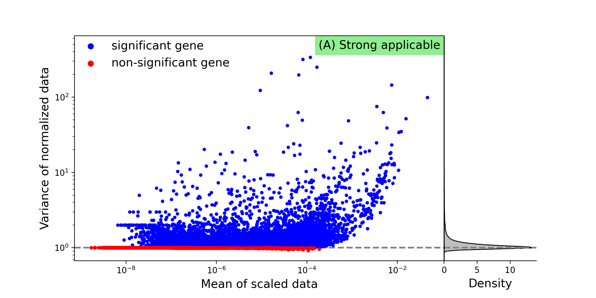
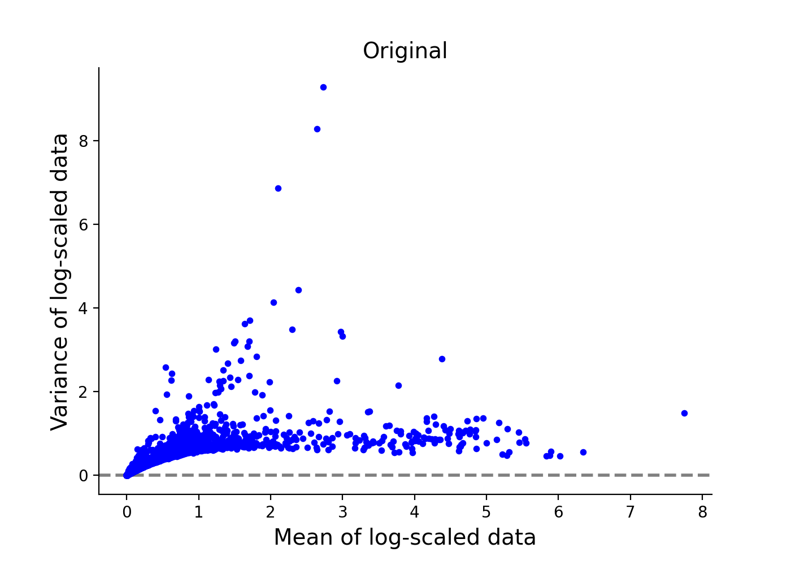
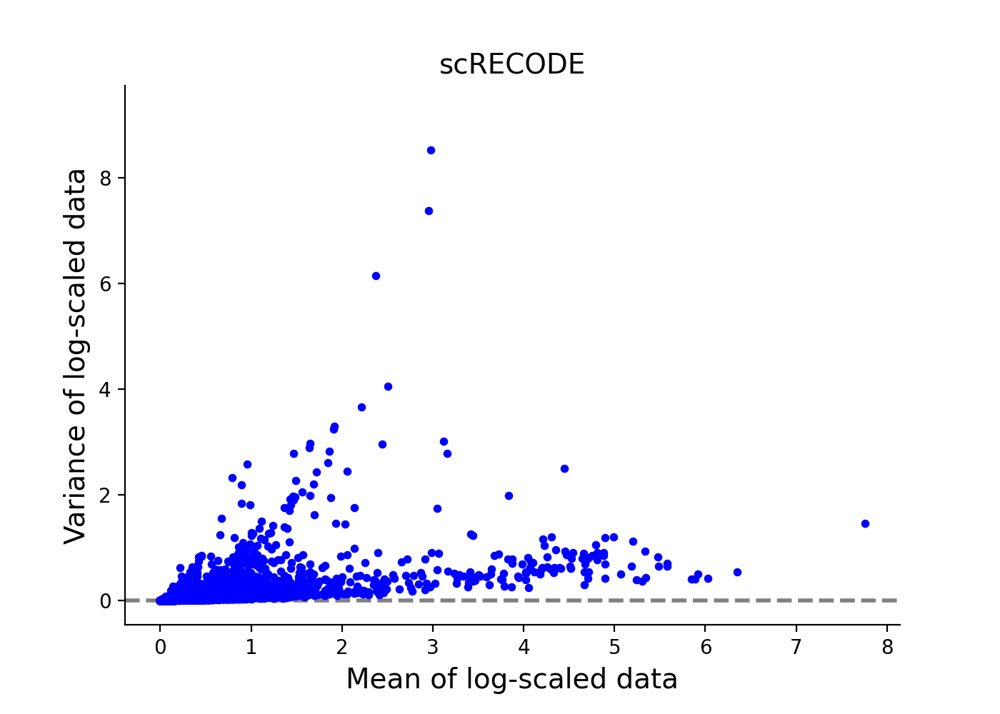
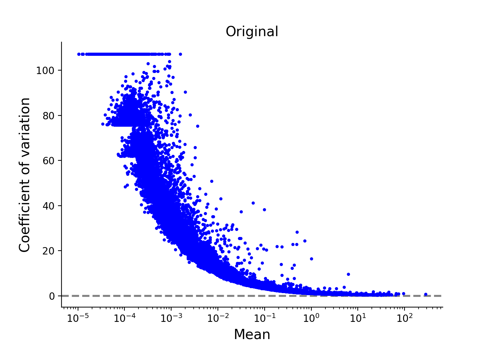
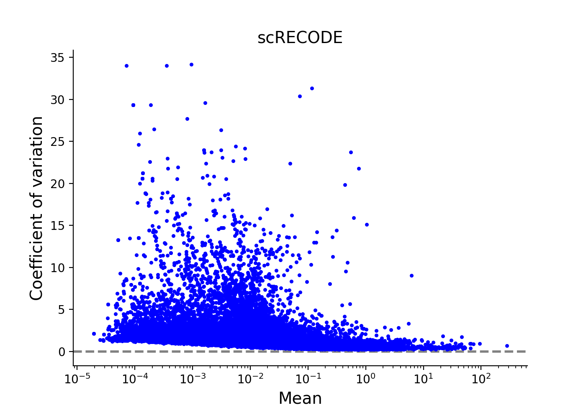
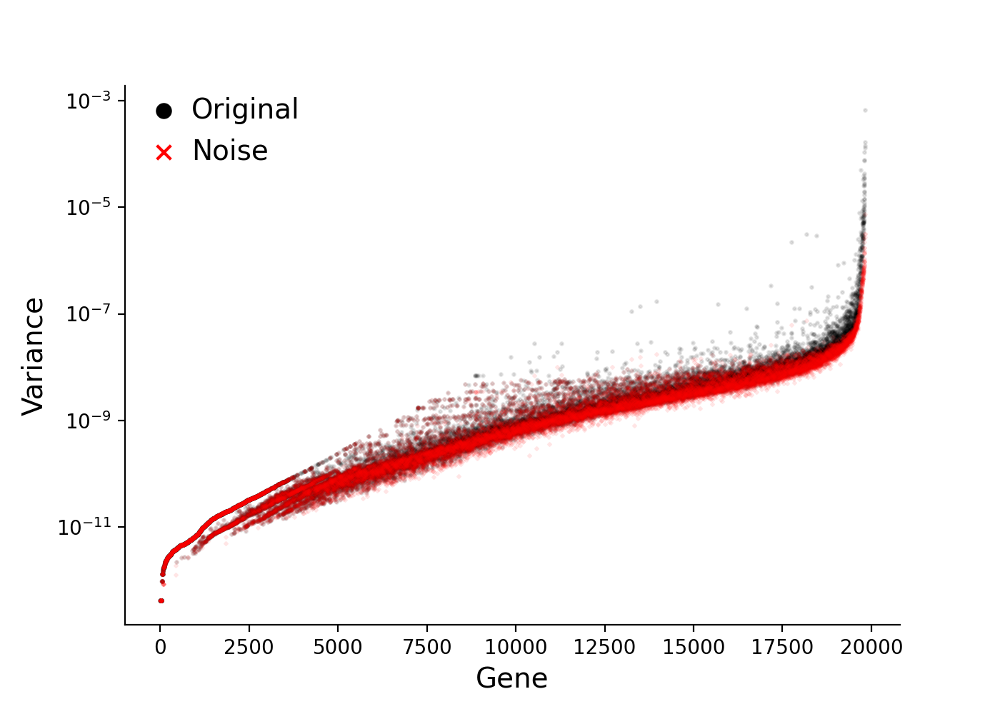

scRNA-seq data - 10X chromium HDF5 file
========

We show an exmaple for scRNA-seq data produced by 10X Chromium. 
We use sample `10k Human PBMCs, 3' v3.1, Chromium Controller` (11,485 cells and 36,601 genes) in `10X Genomics Datasets <https://www.10xgenomics.com/jp/resources/datasets>`_.  
The test data is directly avairable from `Feature / cell matrix HDF5 (filtered)` in `here <https://www.10xgenomics.com/jp/resources/datasets/10k-human-pbmcs-3-v3-1-chromium-controller-3-1-high>`_ (registration required).

We use `scanpy <https://scanpy.readthedocs.io/en/stable/>`_ to read/write 10X HDF5 file (\*\*\*.h5). 
Import  ``numpy``, ``scipy``, and ``scanpy`` in addlition to ``screcode``. 

.. code-block:: python

	import screcode
	import numpy as np
	import scipy
	import scanpy

Imput data from HDF5 file (\*\*\*.h5). 

.. code-block:: python

	input_filename = '10k_PBMC_3p_nextgem_Chromium_Controller_filtered_feature_bc_matrix.h5'
	adata = scanpy.read_10x_h5(input_filename)

Apply scRECODE. The denoised data is created in ``data_scRECODE``.

.. code-block:: python

	recode = screcode.scRECODE()
	data_scRECODE = recode.fit_transform(anndata.X.toarray())

.. parsed-literal::

	start scRECODE for scRNA-seq
	end scRECODE for scRNA-seq
	log: {'seq_target': 'RNA', '#significant genes': 15789, '#non-significant genes': 9322, '#silent genes': 11490, 'ell': 165, 'Elapsed_time': '53.9133[sec]'}
	
Write the denoised data as HDF5 file. 

.. code-block:: python

	adata_scRECODE = adata.copy()
	adata_scRECODE.X = scipy.sparse.csc_matrix(data_scRECODE)
	adata_scRECODE.var['noise_variance'] = recode.noise_variance_
	adata_scRECODE.var['normalized_variance'] = recode.normalized_variance_
	adata_scRECODE.var['significance'] = recode.significance_
	adata_scRECODE.var_names_make_unique()
	output_filename = '10k_PBMC_3p_nextgem_Chromium_Controller_filtered_feature_bc_matrix_scRECODE.h5'
	adata_scRECODE.write(output_filename)

Check applicability. 

.. code-block:: python

	recode.check_applicability()

.. parsed-literal::

	applicabity: (A) Strong applicable

	

Show scatter plots of mean vs variance before and after scRECODE. 	

.. code-block:: python

	recode.plot_mean_variance()

Show scatter plots of mean vs cv (coefficient of variation) before and after scRECODE. 	

.. code-block:: python

	recode.plot_mean_cv()

Show noise variance for genes which are sorted by mean expresion level. 

.. code-block:: python

	recode.plot_noise_variance()

Show the variance after noise-variance-stabilizing normalization. 

.. code-block:: python

	recode.plot_normalization()

.. image:: ../image/Example_10X_RNA_noise_normalization.png

Check the log. 

.. code-block:: python

	recode.log_
	

.. parsed-literal::

	{'seq_target': 'RNA',
	 '#significant genes': 15789,
	 '#non-significant genes': 9322,
	 '#silent genes': 0,
	 'ell': 165,
	 'Elapsed_time': '53.9133[sec]',
	 'Applicability': '(A) Strong applicable',
	 'Rate of 0 < normalized variance < 0.9': '0%',
	 'Peak density of normalized variance': 1.016056101497848}

Show the gene rank based on the CV (detection rate>1%). 

.. code-block:: python
	 
	import pandas as pd
	n_show_genes = 10
	detection_rate_ = np.sum(np.where(adata.X.toarray()>0,1,0),axis=0)/adata.shape[0]
	idx_dr = detection_rate_>0.01
	idx_rank = np.argsort(recode.cv_[idx_dr])[::-1]
	generank = pd.DataFrame({'gene':adata.var.index[idx_dr][idx_rank],
		                       'cv':recode.cv_[idx_dr][idx_rank],
		                       'normalized_variance':recode.normalized_variance_[idx_dr][idx_rank],
		                       'detection_rate':detection_rate_[idx_dr][idx_rank],
		                       'significance':recode.significance_[idx_dr][idx_rank]},
		                      index=np.arange(len(adata.var.index[idx_dr]))+1)
	generank.head(n_show_genes)
	 
.. raw:: html

	

  
	<table border="1" class="dataframe">
		<thead>
		  <tr style="text-align: right;">
		    <th></th>
		    <th>gene</th>
		    <th>cv</th>
		    <th>normalized_variance</th>
		    <th>detection_rate</th>
		    <th>significance</th>
		  </tr>
		</thead>
		<tbody>
		  <tr>
		    <th>1</th>
		    <td>IGHG1</td>
		    <td>31.339773</td>
		    <td>209.024307</td>
		    <td>0.024118</td>
		    <td>significant</td>
		  </tr>
		  <tr>
		    <th>2</th>
		    <td>IGHG2</td>
		    <td>30.394784</td>
		    <td>123.463943</td>
		    <td>0.016195</td>
		    <td>significant</td>
		  </tr>
		  <tr>
		    <th>3</th>
		    <td>IGHA1</td>
		    <td>23.738953</td>
		    <td>315.810333</td>
		    <td>0.053548</td>
		    <td>significant</td>
		  </tr>
		  <tr>
		    <th>4</th>
		    <td>IGLC3</td>
		    <td>21.770362</td>
		    <td>337.377136</td>
		    <td>0.079843</td>
		    <td>significant</td>
		  </tr>
		  <tr>
		    <th>5</th>
		    <td>IGLC1</td>
		    <td>19.827121</td>
		    <td>197.974701</td>
		    <td>0.028733</td>
		    <td>significant</td>
		  </tr>
		  <tr>
		    <th>6</th>
		    <td>IGHG3</td>
		    <td>16.210985</td>
		    <td>18.944107</td>
		    <td>0.019939</td>
		    <td>significant</td>
		  </tr>
		  <tr>
		    <th>7</th>
		    <td>PPBP</td>
		    <td>15.890957</td>
		    <td>49.453533</td>
		    <td>0.014541</td>
		    <td>significant</td>
		  </tr>
		  <tr>
		    <th>8</th>
		    <td>IGLC2</td>
		    <td>15.122184</td>
		    <td>250.899536</td>
		    <td>0.048150</td>
		    <td>significant</td>
		  </tr>
		  <tr>
		    <th>9</th>
		    <td>PF4</td>
		    <td>13.637751</td>
		    <td>18.597492</td>
		    <td>0.010623</td>
		    <td>significant</td>
		  </tr>
		  <tr>
		    <th>10</th>
		    <td>GNG11</td>
		    <td>12.970961</td>
		    <td>9.343362</td>
		    <td>0.012364</td>
		    <td>significant</td>
		  </tr>
		</tbody>
	</table>
	

