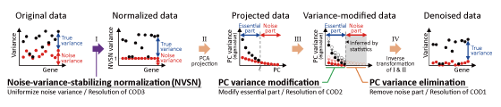

.. RECODE documentation master file, created by
   sphinx-quickstart on Fri Oct  8 15:45:48 2021.
   You can adapt this file completely to your liking, but it should at least
   contain the root `toctree` directive.

RECODE documentation
====================================
**Re**\ solution of **c**\ urse **o**\ f **d**\ im\ **e**\ nsionality (RECODE) is a noise reduction method for single-cell sequencing data. `github <https://github.com/yusuke-imoto-lab/RECODE>`_

Installation
====================================
The python package of RECODE supports PyPI install. 

.. code-block:: bash

 $ pip install screcode

You can also install the development version of lingam package from GitHub:

.. code-block:: bash

	$ pip install git+https://github.com/yusuke-imoto-lab/RECODE.git

or update to the latest version:

.. code-block:: bash

	$ pip install screcode -U

To use RECODE, import ``screcode``. 

.. code-block:: python

 import screcode

The R package is available in `here <https://github.com/yusuke-imoto-lab/RECODE/tree/main/R>`_.

.. toctree::
	:maxdepth: 2
	:caption: Contents:
	
	Tutorials/index
	reference/index

Indices and tables
==================

* :ref:`genindex`
* :ref:`modindex`
* :ref:`search`
